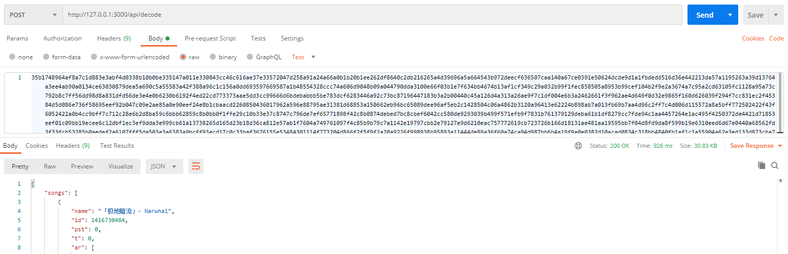

# netease-music-abroad-decode
Javascript decoder for http responses when netease music thinks you are from abroad.

## Build

```bash
# sudo npm i -g vercel
# vercel login
vercel dev
```

## Usage

Send request with raw message netease music returns as HTTP request body.


